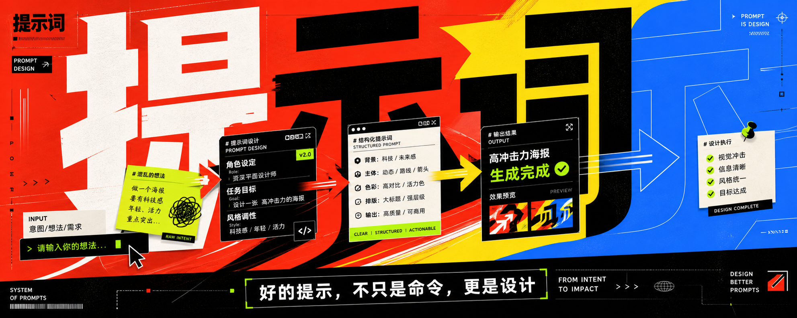

[English](README.en.md) | [中文](README.md)

---

# Cover Prompt Skills

Reusable cover prompt skills for AI agents and image-generation workflows.

Compatible with Claude Code, Codex, Gemini CLI, Cursor, and any agent that supports SKILL.md.

## GitHub Quick Start


1. Open this repository on GitHub and copy the install command you prefer.
2. Run the command in your terminal or agent workspace.
3. Use `$cover-tips` as the daily entry point, or call a specific `cover-*` skill directly.

## GitHub Showcases


## Skills

| Skill | Style | Best For |
|---|---|---|
| `cover-tips` | Style-specific prompt organizer | Turn rough user content into a template or generic image prompt |
| `cover-black-white-minimal` | Black-white minimal, Swiss grid, restrained editorial | Premium concepts, serious essays, portfolio covers |
| `cover-trendy-color-poster` | Trendy high-impact color poster | Product covers, marketplace covers, launch posters |
| `cover-budapest-poster` | Retro Central European cinematic, Budapest-style poster | Theatre, tram, station, bathhouse, archive, postcard concepts |
| `cover-editorial-collage` | Torn-paper editorial collage | Satire, conflict, social commentary, magazine collage covers |
| `cover-tea-oriental` | Oriental tea aesthetic, Song literati, character-as-image | Cultural posters, invitations, infographics, PPT covers |
| `cover-giant-perspective-poster` | Giant Chinese perspective type, high-contrast clash, cinematic/esports KV | Movie posters, sports brand, esports key visuals, viral covers |

## Style Preview

### `cover-black-white-minimal`


### `cover-trendy-color-poster`



### `cover-giant-perspective-poster`


### `cover-editorial-collage`


### `cover-tea-oriental`


## Recommended Daily Use

Use `cover-tips` as the daily entry point when you have rough content and a rough style direction. It cleans up the brief, extracts fields, chooses the matching concrete style skill, and returns a ready-to-use invocation template by default.

Basic formula:

```text
$cover-tips + style + --out-type template|prompt|all + user content
```

Example:

```text
$cover-tips 撕纸剪贴

主题：提示词 副主题：好的提示，不只是命令，更是设计 其他的你定就好 画幅比例：5:2 用途：x封面
```

Default output is a template. This is the same as `--out-type template`, and is recommended when you want to review or edit structured fields before generating the final image:

```text
使用 $cover-editorial-collage 生成一张封面
主题词：提示词
副标题：好的提示，不只是命令，更是设计
画幅比例：5:2
语言：中文
用途：X 封面
情绪倾向：讽刺 / 冲突 / 街头 / 复古 / 观点感
禁用元素：机器人脸、蓝紫霓虹、廉价科技感、PPT 布局、干净矩形堆叠、低质脏乱朋克、不可读文字
```

Ask for a final image prompt when the brief is already clear:

```text
$cover-tips 潮流彩色 --out-type prompt

主题：提示词 副主题：好的提示，不只是命令，更是设计 其他的你定就好 画幅比例：5:2 用途：x封面
```

Use `--out-type all` when you need both the structured template and the final image prompt.

Supported style aliases:

| User style input | Routed skill |
|---|---|
| `黑白极简` / `黑白` / `极简` / `minimal` / `bw` | `$cover-black-white-minimal` |
| `潮流彩色` / `彩色` / `高冲击` / `trendy` / `color` | `$cover-trendy-color-poster` |
| `巨型透视` / `透视标题` / `电影海报风` / `电竞主视觉` / `perspective` | `$cover-giant-perspective-poster` |
| `布达佩斯` / `Budapest` / `复古欧洲` / `电影感` / `明信片` | `$cover-budapest-poster` |
| `撕纸剪贴` / `剪贴` / `拼贴` / `collage` / `editorial collage` | `$cover-editorial-collage` |
| `茶风格` / `茶` / `东方美学` / `宋代美学` / `汉字成像` | `$cover-tea-oriental` |

Call a concrete style skill directly when you already know the exact style and do not need `cover-tips` to reorganize the brief:

```text
$cover-black-white-minimal --out-type prompt
主题：长期主义 副标题：在即时反馈时代重新理解耐心 画幅比例：4:3 用途：文章封面
```

You can also skip template generation entirely and ask a concrete skill to generate the final cover from a natural-language brief:

```text
$cover-editorial-collage 直接生成一张 5:2 的 X 封面，主题是“提示词”，副标题是“好的提示，不只是命令，更是设计”。整体要撕纸剪贴、杂志感、讽刺一点，不要机器人脸和蓝紫霓虹。
```

Use this direct generation path when the style is clear and you do not need to inspect intermediate fields.

Recommended workflow:

1. Start with `$cover-tips <style>` for rough ideas.
2. Use the returned template to confirm title, subtitle, ratio, language, use case, mood, and banned elements.
3. Switch to `--out-type prompt` or `--out-type all` when you need reusable prompt text.
4. Use `$cover-*` followed by natural-language instructions when you want to skip the template and generate the final cover immediately.
5. Directly call `$cover-*` for repeated workflows where the style and fields are already stable.

## Install

Four ways to install.

### CLI Plugin Marketplace

Codex CLI:

```
codex plugin marketplace add imartinstudio/cover-prompt-skills
codex plugin add cover-editorial-collage@cover-prompt-skills
```

Claude CLI:

```
/plugin marketplace add imartinstudio/cover-prompt-skills
/plugin install cover-editorial-collage@cover-prompt-skills
```

Use the command variant for your CLI. In Codex CLI, add the plugin marketplace repository, then install the skill/plugin you need. In Claude CLI, use the `/plugin` slash commands.

After updating an already-installed plugin, refresh/re-enable the plugin or restart the agent so it loads the newest plugin version instead of the cached version.

### npx

```
npx skills add imartinstudio/cover-prompt-skills
```

Pick the skills you want interactively. Works in Claude Code, Codex, Cursor, Gemini CLI, Windsurf, and 40+ other agents.

### curl

```bash
curl -fsSL https://raw.githubusercontent.com/imartinstudio/cover-prompt-skills/main/install.sh | bash
```

Install a single skill:

```bash
curl -fsSL https://raw.githubusercontent.com/imartinstudio/cover-prompt-skills/main/install.sh | bash -s -- cover-editorial-collage
```

Skills are downloaded as standalone `SKILL.md` files to the target directory. The script defaults to `~/.shared-skills`; different agents may use different skill directories, and Codex / Agents users can usually set `~/.agents/skills` or `~/.codex/skills`:

```bash
COVER_SKILLS_TARGET=~/.agents/skills \
curl -fsSL https://raw.githubusercontent.com/imartinstudio/cover-prompt-skills/main/install.sh | bash
```

### Local development

```bash
cd cover-prompt-skills
./install.sh                              # install all (symlinks)
./install.sh cover-editorial-collage      # install one
```

Local development install creates symlinks from this repository's skill directories into the target directory, which is useful when editing the repository and testing in an agent.

`cover-tips` is a navigator skill. It is installed with the full package, but cannot be installed alone — it depends on concrete cover style skills.

## Repository Principles

- Keep each plugin minimal: one `SKILL.md` under `skills/`, one manifest each for Claude Code and Codex.
- Do not include provider-specific agent metadata by default.
- Keep prompts generic unless a user explicitly asks for a provider-specific variant.
- Use `cover-` as the naming prefix for cover-generation skills.

## License

MIT
